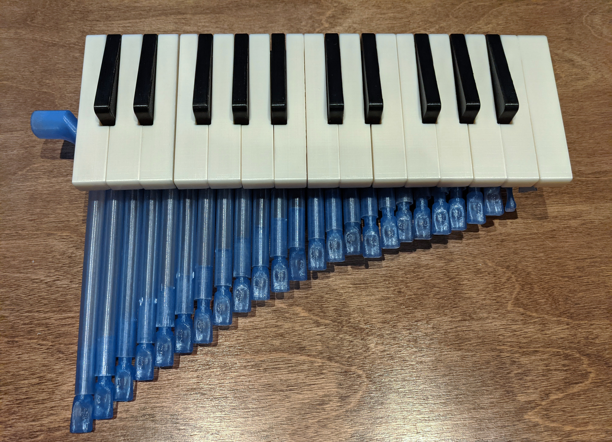
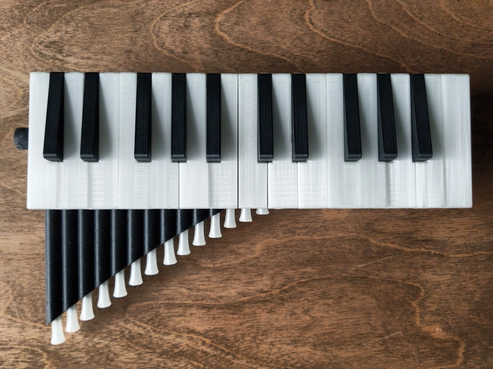

# Ice Keys

An acoustic keyboard that sounds like polyphonic pan pipes.

## Prototype Versions

### [Ice Keys P1](p1/project-notes.md)

The first prototype, with 25 keys. A 3-tone color palette and exposed mechanisms give it a steampunk feel.

Main Issues:

1. **Pipe sealing.** The pipes don’t seal well enough with the blocks that hold them, so the sound is at best a whisper.
2. **Heavy key action.** The keys are hard to press.
3. **Bad ergonomics.** It’s hard to hold (since it has no handle) and hard to play (since it has stiff, narrow keys).
4. **Incorrect pipe lengths.** The model I used to determine the lengths is based on too many idealizations.
5. **Looks.** The blue color is too pale and the off-white keys look dirty.

### [Ice Keys P2](p2/project-notes.md)

The first playable version, also with 25 keys. Minimal casing and a better 2-tone PLA palette make for a sleek, versatile second prototype.

Main issues:

1. Some valves stopped closing after some time in storage, making some notes sound whether played or not.
2. Tuning requires a steady source of air with reproducible pressure, e.g. from a bellows.
3. While the appearance and ergonomics are much better, it still feels like a prototype. Some edges are unfinished; some mechanisms uncovered.

### [Ice Keys P3](p3/project-notes.md)

This is the current prototype, a work in progress. With its larger 30-key range, comprehensive case and compact action, it improves on P2 in many areas. This version will have a 3-tone color palette, sporting a translucent royal blue and clear keys on a black body.

Main issues:

1. Pipe sealing. The switch to PETG filament made bubbles and tiny pores more common, which surprised me because PETG has exceptional layer adhesion. In addition, I added a 180° bend to the lower pipes. That curved roof has a large porosity as well.
2. Anticipated: Tuning. This iteration will also need a steady air source for tuning.
